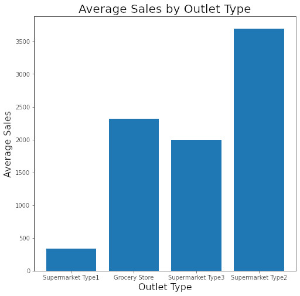

# Boost sales by focusing on products and stores that are underperforming.
## Data visualizations show trends in outlets sales. A machine learning model predicts sales at each outlet.

**Michael Vincent**: 

### Business problem:

Data was analyzed to see which outlets and products were generating the most sales. A machine learing model was constructed to predict the sales at an outlet based on aspects of the outlet and products sold.

### Data:
The data can be downloaded [here.](https://docs.google.com/spreadsheets/d/e/2PACX-1vRNQ2yuuZKv8cbgh4i4BHnxryjbO8BUviZeIPvva0lIUS23NLolb67KroUgKUOLljhQwxTJZSZrhnyY/pub?output=csv)
There are 8523 data points with twelve features including price, and the type of item sold, and type of outlet it was sold at.

## Methods
- Inconsistent labels fixed for descriptions of fat content.
- Missing values of weights were filled with the average weight of the item sold. This was justified on the fact that the average weight of each class of item was similar.
- Missing values of the outlet size were filled with the value 'missing.' 
- Visualizations were constructed to relate sales with item type and outlet type.
- Categorical data was encoded into numerical data for data modelling.
- A linear regression model was contstructed.
- A random forest model was constructed.

## Results

#### Visual 1 Title

> Sentence about visualization.

#### Visual 2 Title

## Model

The random forest performed better than the linear regression so we chose that as our final model. It was able to account for about 60% of the variance in the data. It had a mean absolute error of about $750, so we expect a prediction of sales from a typical outlet to be off by about $750. The root mean squared error was higher at about $1075 which suggests our model was making some large errors.

## Recommendations:

The outlet "Supermarket Type1" is significantly underperforming on average compared to the other types of outlets. We reccomend exploring why this is the case and taking steps to boost sales at these outlets.

The item types "seafood", "breakfast", and "starchy foods" are among those with the lowest sales. Perhaps some promotions among these item types could generate more revenue.

## Limitations & Next Steps

Since our model is only accounting for 60% of the variation in the data, we would like to gather more data in order to produce a more accurate model. 

### For further information

For any additional questions, please contact **michael.vincent@employer.com**

